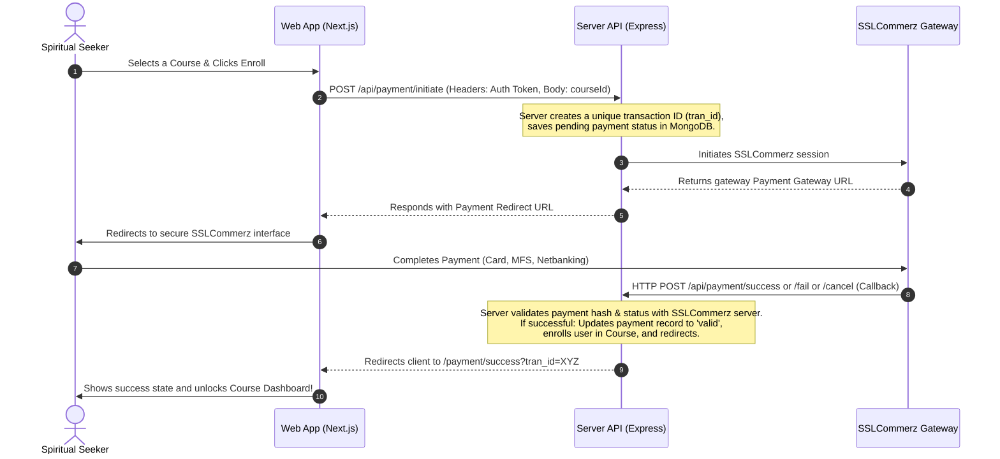

# 🌿 Path to Peace — Full-Stack Meditative Editorial

**Path to Peace** is a digital sanctuary designed as a "Meditative Editorial." It offers a serene, premium experience for spiritual seekers, blending modern design aesthetics (glassmorphism, subtle micro-animations, and balanced typography) with classical wisdom.

The project is structured as a robust **pnpm-workspace monorepo** consisting of a fast, modern **Next.js frontend** and a high-performance **Express.js API server** backed by **MongoDB**, secured with **Better Auth**, and integrated with the **SSLCommerz** payment gateway.

---

## 🎨 The Design Philosophy: "The Meditative Editorial"

The system adheres to a premium design system tailored for tranquility:
*   **Intentional Asymmetry:** Layouts that breathe through expansive negative space, preventing clutter.
*   **Tonal Layering:** Visual depth achieved through subtle, light-themed color shifts and glassmorphic elevations rather than harsh shadows.
*   **The Emerald & Cream Palette:** A curated, harmonious color scheme:
    *   **Deep Emerald** (`#003527`) – Representing growth, life, and spiritual guidance.
    *   **Luminous Cream** (`#fbf9f5`) – Emitting a soft, welcoming light that reduces eye strain.
*   **Elegant Typography:** A contrast between the soul-stirring *Noto Serif* (for classical verses, duas, and quotes) and the architectural *Plus Jakarta Sans* (for navigation, structures, and modern data).

---

## ✨ Key Features

### 👤 User Dashboard
*   **Personalized Profile Sanctuary:** A custom interface showing enrolled courses, progress, and saved spiritual guidance.
*   **Saved Collections:** Separate tabs to browse and manage saved **Duas**, **Quranic Verses (Ayahs)**, and emotional states configured in the **Feeling Tool**.

### 🌿 The Feeling Tool (Spiritual Therapy)
*   An interactive, meditative feature designed to cultivate inner emotional balance.
*   Users choose their current state of mind or heart (e.g., *Sad*, *Anxious*, *Grateful*, *Stressed*).
*   The system dynamically maps their selected feeling to authentic Quranic verses, prophetic Duas, and targeted spiritual exercises.

### 📖 Quran & Dua Explorer
*   **Tranquil Reading Experience:** Distraction-free Quran surah reader with clean translation, transliteration, and a quick-save utility.
*   **Structured Duas:** Authentically sourced Duas organized by category (e.g., Morning & Evening, Protection, Guidance), accompanied by Arabic scripts and phonetic guides.

### 🎓 Courses & E-Learning Portal
*   **Interactive Courses:** Designed to cultivate peace, mindfulness, and theological wisdom.
*   **SSLCommerz Gateway Integration:** Direct integration with Bangladesh's premier payment gateway supporting automatic checkouts and robust transactions.

### 🛡️ Secure Full-Stack Authentication
*   Fully powered by **Better Auth** with MongoDB adapters.
*   Secure role-based access control (**Admin** vs **User** roles) enforced both client-side via React hooks and server-side via custom Express middleware.

### 📊 Administrative Management Suite (CRUD)
*   **Dashboard Stats:** Comprehensive real-time metrics showing registration rates, enrollment counts, course revenue, and popular duas/feelings.
*   **User Management:** View registered users, assign roles, and delete accounts securely.
*   **Course Management:** Full CRUD operations for creating, updating, pricing, and organizing digital courses.
*   **Dua & Feeling Mappings:** Tools to upload new Duas or configure complex emotional pairings in the Feeling Tool.

---

## 🛠️ Technology Stack

| Layer | Technologies |
| :--- | :--- |
| **Monorepo Orchestrator** | `pnpm` workspaces, Turborepo (optional) |
| **Frontend Application** | Next.js 16 (App Router), Tailwind CSS v4, React 19, shadcn/ui, Radix UI, Base UI, Lucide Icons |
| **Backend API Server** | Node.js, Express.js (v5), TypeScript, `tsup` (bundler), `tsx` (TS dev runtime) |
| **Database** | MongoDB (Official Client Driver) |
| **Authentication** | Better Auth (Client & Express Node Handlers) |
| **Payments** | SSLCommerz API Gateway Integration |

---

## 📂 Project Structure

```
path-to-peace/
├── apps/
│   ├── server/                     # Express.js REST API Server
│   │   ├── src/
│   │   │   ├── controllers/        # Business logic controllers (admin, course, payment, saved-items, user)
│   │   │   ├── db/                 # MongoDB connection and database seeding scripts
│   │   │   ├── middleware/         # Session validation & admin authentication middleware
│   │   │   ├── routes/             # Grouped API route mounts (user, admin, course, payments, saved items)
│   │   │   ├── utils/              # SSLCommerz client utility & third-party connectors
│   │   │   ├── auth.ts             # Better Auth server configuration
│   │   │   └── index.ts            # Main API entry point (Express initialization)
│   │   ├── package.json
│   │   └── tsconfig.json
│   │
│   └── web/                        # Next.js 16 React Frontend Application
│       ├── app/                    # Next.js App Router routes (Dashboard, Admin, Feeling-Tool, Quran, Payments, etc.)
│       ├── components/             # Premium UI & layout components (shadcn/ui, layouts, pages, features)
│       ├── hooks/                  # Custom React hooks (auth, dashboard states)
│       ├── lib/                    # Core utilities, API clients, and static JSON datasets
│       ├── public/                 # High-resolution assets, icons, and meditative illustrations
│       ├── package.json
│       └── tsconfig.json
│
├── package.json                    # Workspace task orchestration
└── pnpm-workspace.yaml             # pnpm workspace definition
```

---

## ⚙️ Environment Configuration

To run the application locally, you must configure environment variables for both the backend server and the frontend application.

### 1. Backend Server Setup (`apps/server/.env`)
Create a `.env` file inside `apps/server/` matching the template below:
```env
PORT=3001
MONGODB_URI=your_mongodb_connection_string
BETTER_AUTH_SECRET=your_better_auth_secret_key
BETTER_AUTH_URL=http://localhost:3001

# SSLCommerz Sandboxed Credentials
SSL_STORE_ID=your_sslcommerz_store_id
SSL_STORE_PASSWORD=your_sslcommerz_store_password
SSL_SANDBOX=true
SSL_SESSION_API=https://sandbox.sslcommerz.com/gwprocess/v4/api.php
SSL_VALIDATION_API=https://sandbox.sslcommerz.com/validator/api/validationserverAPI.php

# Frontend Web Origin
NEXT_PUBLIC_WEB_URL=http://localhost:3000
```

### 2. Frontend Application Setup (`apps/web/.env.local`)
Create a `.env.local` file inside `apps/web/` matching the template below:
```env
NEXT_PUBLIC_API_URL=http://localhost:3001
```

---

## 🚀 Getting Started

### Prerequisites
Make sure you have [Node.js (v18+)](https://nodejs.org/) and [pnpm](https://pnpm.io/) installed on your machine.

### Installation
1. Clone the repository and navigate to the project directory:
   ```bash
   git clone https://github.com/Sumyta-Bentey-Habib/path-to-peace.git
   cd path-to-peace
   ```

2. Install the workspace dependencies:
   ```bash
   pnpm install
   ```

### Database Seeding
The backend contains an automated database seeder (`apps/server/src/db/seed.ts`). Upon first startup:
* It reads initial Duas and Feeling-Tool configurations from the frontend's static data sets (`apps/web/lib/data`).
* It inserts them into MongoDB collections automatically.
* It initializes a default active course to prevent empty listings.

### Running in Development
The monorepo contains dedicated scripts in the root `package.json` to orchestrate tasks. We recommend running the server and web application in two separate terminals:

*   **Terminal 1 (Backend Server):**
    ```bash
    pnpm dev:server
    ```
    *The API will start at [http://localhost:3001](http://localhost:3001)*

*   **Terminal 2 (Frontend App):**
    ```bash
    pnpm dev
    ```
    *The web interface will start at [http://localhost:3000](http://localhost:3000)*

---

## 🔐 Administrative Account Setup

Since the dashboard enforces strict role-based authorization, you will need an administrative account to access `http://localhost:3000/admin`.

1. Run both applications and go to the web app (`http://localhost:3000`).
2. Register a new account via the standard registration form (`/sign-up`).
3. While logged in, trigger the promotional utility endpoint to set your user role as an admin:
   ```
   GET http://localhost:3001/api/admin/set-me-as-admin
   ```
   *(Ensure cookies/credentials are forwarded, or invoke the route directly while authenticated)*.
4. Your account is now upgraded to `admin`. You can navigate to `/admin` to manage the sanctuary!

---

## 💳 SSLCommerz Payment Integration Flow

The application implements a robust transaction cycle for digital courses:



---

## 🌿 Core Architecture Practices & Guidelines

If you're pair-programming or extending the code:
*   **Documentation:** Maintain full docstrings and keep comments clear, particularly around spiritual themes.
*   **State Management:** Always use secure validation schemas (`zod`) in API controller endpoints to validate incoming payload states.
*   **Styling:** Follow the *Meditative Editorial* system. Avoid ad-hoc coloring. Use the tailored CSS tokens inside `globals.css` and Tailwind variables.
*   **Clean Auth Context:** Rely on the `authMiddleware` helper inside `apps/server/src/middleware/auth.middleware.ts` to retrieve valid session details.

---
*“Seek tranquility through knowledge, and let the heart rest in divine wisdom.”*
